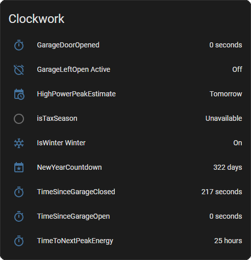
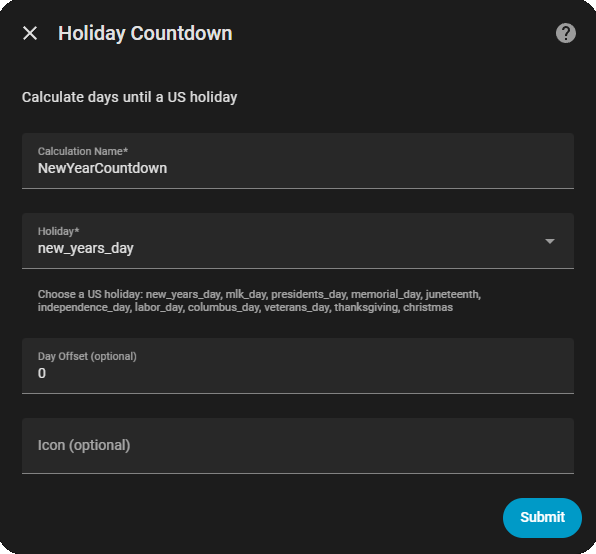

<br/>

[](https://github.com/hacs/custom-repositories)
[](https://github.com/mutilator/clockwork/releases)


# Clockwork

`Clockwork` is a custom integration for [Home Assistant](https://www.home-assistant.io/) that provides advanced date, time, and duration calculations. Create sensors and binary sensors for measuring timespans, checking date ranges, detecting seasons, and triggering time-based automations.

## Features

- **Timespan Calculations**: Calculate duration since an entity changed state, with configurable tracking modes
- **Offset Calculations**: Time-delayed triggers with pulse, duration, and latch modes
- **Datetime Offset**: Apply time offsets to datetime entities for scheduling
- **Date Range Duration**: Measure duration between two datetime entities
- **Season Detection**: Detect current season automatically
- **Month Detection**: Check if current date falls in specified months  
- **Holiday Countdowns**: Built-in US holidays plus custom holiday support
- **Date Range Checks**: Determine if current time is within or outside a range
- **Custom Automation Conditions**: Duration-based conditions for automations (check how long since entity changed or automation was last triggered)
- **Calendar Services**: Get, update, and delete calendar events (requires calendar integration)
- **No YAML Required**: All configuration through intuitive Home Assistant UI
- **Real-time Updates**: Configurable update intervals for time-based sensors
- **Flexible Triggering**: Control which state changes trigger offset calculations
- **Timezone Aware**: Automatic timezone handling for datetime comparisons

## Documentation & Examples

For detailed guides and examples for each calculation type, visit the **[Clockwork Wiki](https://github.com/mutilator/clockwork/wiki)**:

| Topic | Link |
|-------|------|
| Getting Started | [Home](https://github.com/mutilator/clockwork/wiki/Home) |
| Timespan Calculation | [Calculate duration since state change](https://github.com/mutilator/clockwork/wiki/Timespan-Calculation) |
| Offset Calculation | [Time-delayed triggers](https://github.com/mutilator/clockwork/wiki/Offset-Calculation) |
| Datetime Offset | [Apply time offsets to datetime entities](https://github.com/mutilator/clockwork/wiki/Datetime-Offset) |
| Date Range Duration | [Measure duration between dates](https://github.com/mutilator/clockwork/wiki/Date-Range-Duration) |
| Season Detection | [Detect current season automatically](https://github.com/mutilator/clockwork/wiki/Season-Detection) |
| Month Detection | [Check if current date is in specified months](https://github.com/mutilator/clockwork/wiki/Month-Detection) |
| Holiday Countdown | [Days until next holiday](https://github.com/mutilator/clockwork/wiki/Holiday-Countdown) |
| Custom Holidays | [Define your own holidays](https://github.com/mutilator/clockwork/wiki/Custom-Holidays) |
| Between/Outside Dates | [Date range checks](https://github.com/mutilator/clockwork/wiki/Between-Dates-Check) |
| Custom Automation Conditions | [Duration-based automation conditions](https://github.com/mutilator/clockwork/wiki/Custom-Automation-Conditions) |
| Scan Automations | [Discover time-based automations](https://github.com/mutilator/clockwork/wiki/Scan-Automations) |
| Calendar Services | [Manage calendar events](https://github.com/mutilator/clockwork/wiki/Calendar-Services) |

## Screenshots

### Sensor Types Created
Clockwork creates different types of sensors depending on the calculation type:



### Holiday Countdown Example
Create countdown sensors for holidays and special dates:



## Installation

### Via HACS (Recommended)

1. Open HACS in Home Assistant
2. Click "Custom repositories" in the top right
3. Add this repository:
   - **Repository URL**: `https://github.com/mutilator/clockwork`
   - **Category**: Integration
4. Click "Install"
5. In Home Assistant, go to **Settings > Devices & Services**
6. Click **Create Automation** and search for "Clockwork"
7. Follow the setup wizard

### Manual Installation

1. Download the [latest release](https://github.com/mutilator/clockwork/releases)
2. Unzip and copy the `clockwork` folder to:
   ```
   ~/.homeassistant/custom_components/
   ```
3. Restart Home Assistant
4. Go to **Settings > Devices & Services > Create Automation** and search for "Clockwork"

## Configuration

All configuration is done through the Home Assistant UI. No YAML editing required!

1. Go to **Settings > Devices & Services > Clockwork**
2. Select **Configure**
3. Choose from:
   - **Add Calculation** - Create a new sensor or binary sensor
   - **Modify Calculation** - Edit existing calculations
   - **Delete Calculation** - Remove calculations
   - **Add Custom Holiday** - Define custom holidays for countdowns
   - **Modify Custom Holiday** - Edit existing custom holidays
   - **Delete Custom Holiday** - Remove custom holidays

### Calculation Types

- **Timespan** - Measure duration since state change
- **Offset** - Trigger after elapsed time
- **Datetime Offset** - Apply time offset to datetime
- **Date Range Duration** - Measure duration between two datetimes
- **Season Detection** - Detect spring, summer, autumn, or winter
- **Month Detection** - Check specific months
- **Holiday Countdown** - Days until US holidays or custom dates
- **Between Dates** - True when current time is within range
- **Outside Dates** - True when current time is outside range

### Scan Automations Service

Discover which of your automations use time or date-based triggers and conditions. This helps you identify automations that could benefit from Clockwork calculations.

**How to use:**
- Go to **Settings > Devices & Services > Clockwork > Configure**
- Select **Scan Automations for Time Patterns**
- Results display immediately showing automations with time/date patterns

Or call the service directly:
- Go to **Developer Tools > Services**
- Call `clockwork.scan_automations`
- Results show in logs and notifications

See [Scan Automations](https://github.com/mutilator/clockwork/wiki/Scan-Automations) wiki page for details.

## Quick Example

To see Clockwork in action, use an **Offset Calculation** for a garage door alert:

**Traditional Approach** (with delays and conditions):
```yaml
automation:
  - alias: "Garage Door Alert"
    trigger:
      platform: state
      entity_id: binary_sensor.garage_door
      to: "on"
    action:
      - delay: "00:30:00"  # Wait 30 minutes
      - condition: state
        entity_id: binary_sensor.garage_door
        state: "on"  # Still open?
      - service: notify.send_alert
        data:
          message: "Garage door has been open for 30 minutes"
```

**With Clockwork** (simple, robust, restart-safe):
1. Create an **Offset Calculation**:
   - Name: "Garage Door Open 30min"
   - Entity: `binary_sensor.garage_door`
   - Time Offset: "30 minutes"
   - Behavior Mode: "pulse" (alert once) or "duration" (stay active while alert is relevant)
   - Trigger Event: "on"

2. Simplify your automation:
```yaml
automation:
  - alias: "Garage Door Alert"
    trigger:
      platform: state
      entity_id: binary_sensor.garage_door_open_30min
      to: "on"
    action:
      service: notify.send_alert
      data:
        message: "Garage door has been open for 30 minutes"
```

**Key Benefit**: The offset calculation **survives Home Assistant restarts** — the 30-minute timer continues accurately even if HA restarts. No delays, no conditions, no hassle.

For more examples and walkthroughs, see the [wiki](https://github.com/mutilator/clockwork/wiki).

## Support & Contributing

- **Issue Tracker**: [GitHub Issues](https://github.com/mutilator/clockwork/issues)
- **License**: MIT License - See [LICENSE](LICENSE) for details

## Credits

Clockwork is built to integrate seamlessly with Home Assistant and follows all Home Assistant custom component standards.

---

**Ready to get started?** Head over to the [wiki](https://github.com/mutilator/clockwork/wiki) for detailed guides and examples!
